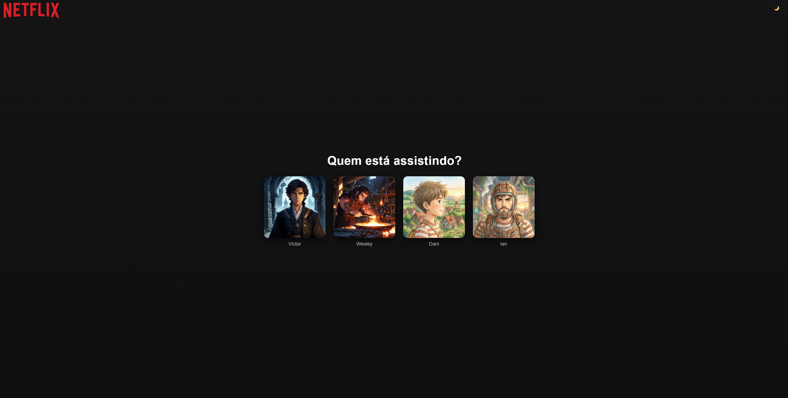

# Netlura — clone Netlfix (Tema Dark / Light Mode)

Projeto clone da tela de seleção de perfis da Netflix com suporte a alternância entre temas escuro e claro.



## 📝 Principais funcionalidades

- **Alternância Dark/Light**: Troca imediata entre modos escuro e claro.
- **Tema padrão**: Tema escuro como padrão de inicialização.
- **Responsivo**: Layout adaptável para todas as telas.

## ▶️ Como usar (localmente)

1. Clone ou baixe este repositório.
2. Abra o arquivo `index.html` no navegador ou use uma extensão como Live Server.
3. Clique no botão de alternância (toggle) no canto superior direito para trocar o tema.

## 🛠️ Tecnologias Utilizadas

- **HTML5**: Estrutura semântica
- **CSS3**: Variáveis, media queries, transições
- **JavaScript**: Lógica de alternância de tema e do conteúdo da página de catálogo. 

## 📁 Estrutura do Projeto

```
/
├── index.html              # Página principal
├── catalogo.html           # Página de catálogo (exibe lista de filmes, séries, animações, etc.)
├── css/                    # Pasta com os arquivos de estilo (CSS) das páginas
│   ├── style.css           # Estilos da página principal
│   └── catalogo.css        # Estilos da página de catálogo
├── js/                     # Pasta com toda a lógica do projeto (JavaScript)
│   ├── main.js             # Controla a exibição dos conteúdos com base no perfil ativo
│   ├── script.js           # Gerencia o tema e define qual perfil está ativo
│   ├── utils.js            # Funções auxiliares (ex.: criação e exibição de badges)
│   ├── data.js             # Dados do catálogo (categorias, imagens, trailers, etc.)
│   └── components/         # Componentes reutilizáveis da página de catálogo
│       ├── Card.js         # Componente responsável por renderizar cada card
│       └── Carousel.js     # Componente de carousel que organiza os cards por categoria
└── assets/                 # Arquivos de mídia (imagens, ícones, etc.)
```

Divirta-se! 🖥️

